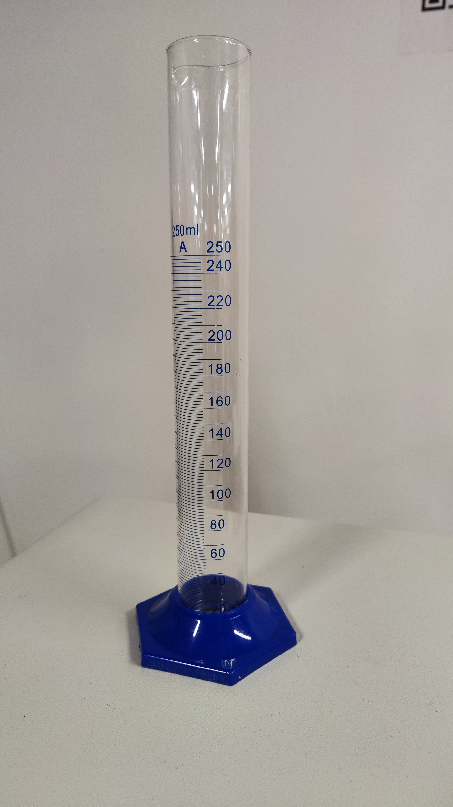
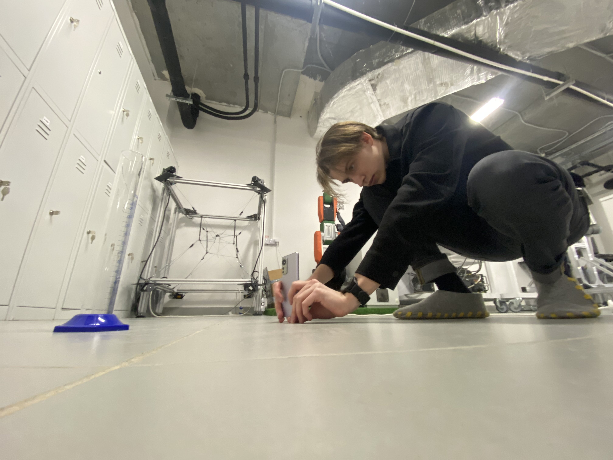
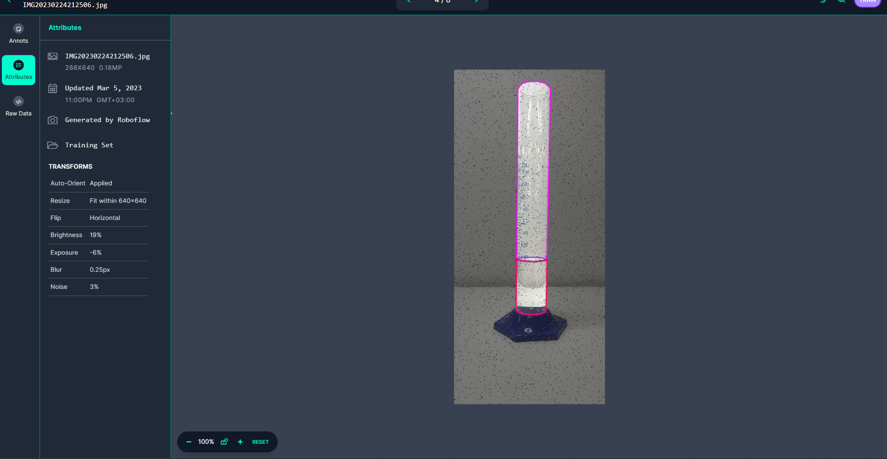

# Object detection assignment

The goal of this assignment is to give students the least amount of details and expect a lot in return, just like in a real job. 

## Report

1. Take photos of your environment of two or more objects. (at least 100 instances between all objects)

I took the graduated flask and filled it with liquid. The example of the image:

The process of taking the images on the phone:

Therefore, I had 3 objects to detect: the graduated flask, the liquid level and the liquid level length.

2. Annotate them on roboflow.

I annotated the images on roboflow and got 3 classes: graduated flask, liquid level and liquid level length. The example of the annotation:

3. Train a Faster RCNN model using detectron2

- [Colab](https://colab.research.google.com/drive/1dyoVrx95-QVLKojj6DsNda2vaG_KigKx?usp=sharing)
- [File](./FasterRCNN.ipynb)

4. Train Yolov4/5/6/7/8 (only one of them of choice) the smallest size

I trained the YOLOv8 nano.

- [Colab](https://colab.research.google.com/drive/1aAY2FftxbXOi5fEcNgYjRiPsnbXLuToN?usp=sharing)
- [File](./YOLOv8n.ipynb)

5. Evaluate both models based on mAP and speed and size.

I evaluated the models based on mAP and speed and size. The results are in the following table:

| Model | mAP | Training Speed | Inference Speed | Size |
| --- | --- | --- | --- | --- |
| YOLOv8n | 0.983 | 25 epochs completed in 0:07:52 | 1.9ms pre-process, 5.8ms inference, 0.0ms loss, 3.2ms post-process per image | 6.2MB |
| Faster RCNN | 0.967 | 1498 iterations in 0:53:44 | Dataloading: 0.0071 s/iter. Inference: 0.2317 s/iter. Eval: 0.0004 s/iter. Total: 0.2393 s/iter. | 797MB  |