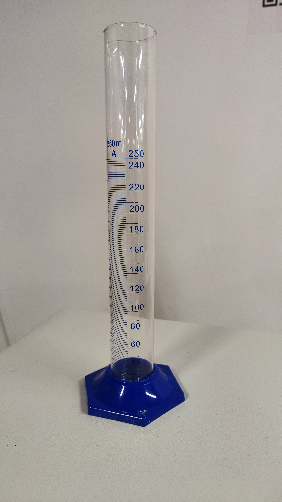
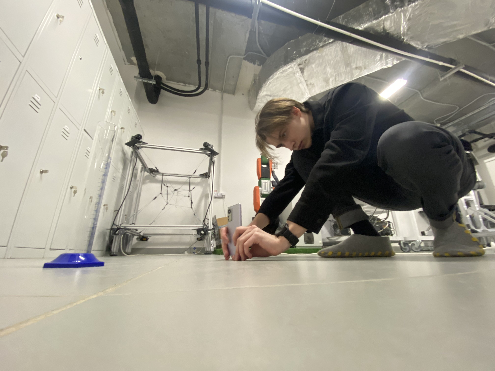
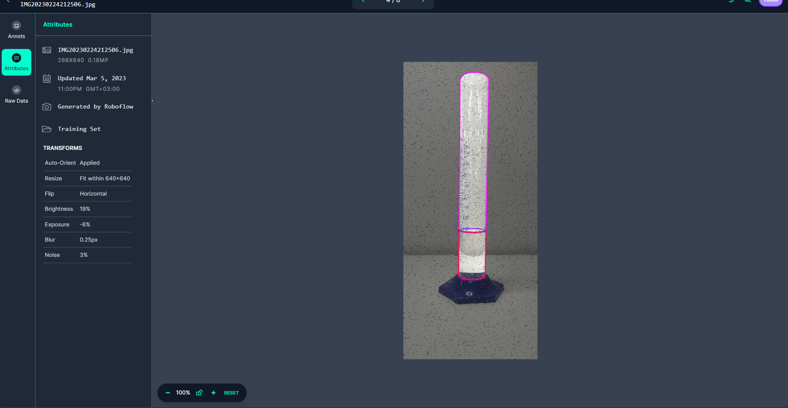

# Object segmentation assignment

The goal of this assignment is to give students the least amount of details and expect a lot in return, just like in a real job. 

## Report

1. Take photos of your environment of two or more objects. (at least 100 instances between all objects)

I took the graduated flask and filled it with liquid. The example of the image:

The process of taking the images on the phone:

Therefore, I had 3 objects to detect: the graduated flask, the liquid level and the liquid level length.

2. Annotate them on Roboflow for segmentation. 

I annotated the images on roboflow and got 3 classes: graduated flask, liquid level and liquid level length. The example of the annotation:

3. Train a Mask RCNN model using detectron2

I used the following [Mask RCNN model](https://github.com/facebookresearch/detectron2/blob/main/configs/COCO-InstanceSegmentation/mask_rcnn_R_50_FPN_3x.yaml).

- [Colab](https://colab.research.google.com/drive/1FMGGGbrX9vSN6FeeJb2vvvKtpBsqYRSL?usp=sharing)
- [File](./MaskRCNN.ipynb)

4. Train YOLOv8 the smallest size for segmentation

I trained the YOLOv8 nano.

- [Colab](https://colab.research.google.com/drive/1WUAGG-TMznCKOcnaj5PbK1nq14IRogNN?usp=sharing)
- [File](./YOLOv8n.ipynb)

5. Evaluate both models based on mAP and speed and size.

I evaluated the models based on mAP and speed and size. The results are in the following table:

| Model | mAP | Training Speed | Inference Speed | Size |
| --- | --- | --- | --- | --- |
| Mask RCNN |  |  |  |  |
| YOLOv8n | 0.98 | 25 epochs completed in 00:07:22 | Speed: 0.4ms pre-process, 7.8ms inference, 5.2ms postprocess per image | 5.94MB |